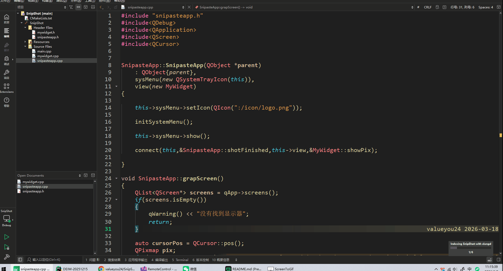

# SnipShot - Qt6 截图工具

SnipShot 是一个基于 Qt6 框架开发的轻量级屏幕截图工具，支持多显示器环境下的屏幕截图功能，并提供直观的截图预览界面。

## 功能特性

- **系统托盘集成**：程序启动后自动最小化到系统托盘，不占用任务栏空间，保持桌面整洁
- **多显示器支持**：智能识别鼠标所在的显示器，精确截取当前屏幕内容
- **实时截图预览**：截图完成后自动弹出预览窗口，即时查看截取结果
- **简洁操作界面**：通过系统托盘右键菜单进行截图和退出操作，操作简单直观

## 功能演示



## 技术架构

### 项目结构

```
SnipShot/
├── main.cpp              # 应用程序入口，初始化Qt应用
├── snipasteapp.h/.cpp    # 主应用类，管理系统托盘和截图逻辑
├── mywidget.h/.cpp       # 截图预览窗口组件，负责图像显示
├── CMakeLists.txt        # CMake 构建配置文件
├── res.qrc               # Qt 资源文件，管理图标资源
└── icon/
    └── logo.png          # 系统托盘图标（需自行添加）
```

### 核心组件说明

| 组件 | 职责描述 | 关键方法 |
|------|----------|----------|
| **SnipasteApp** | 主应用逻辑控制器，管理系统托盘、菜单和截图流程 | `grapScreen()`, `initSystemMenu()` |
| **MyWidget** | 截图预览窗口，负责接收并显示截取的图像 | `showPix(QPixmap)`, `paintEvent()` |

### 工作流程图

```
用户右键点击托盘图标
        │
        ▼
选择"截图"菜单
        │
        ▼
┌───────────────────────┐
│ 获取所有显示器列表     │
│ QApplication::screens()│
└───────────┬───────────┘
            │
            ▼
┌───────────────────────┐
│ 获取鼠标当前位置       │
│ QCursor::pos()        │
└───────────┬───────────┘
            │
            ▼
┌───────────────────────┐
│ 遍历屏幕找到目标显示器 │
│ rect.contains(cursor) │
└───────────┬───────────┘
            │
            ▼
┌───────────────────────┐
│ 截取屏幕图像          │
│ screen->grabWindow()  │
└───────────┬───────────┘
            │
            ▼
┌───────────────────────┐
│ 发送截图完成信号       │
│ emit shotFinished()   │
└───────────┬───────────┘
            │
            ▼
┌───────────────────────┐
│ 预览窗口显示截图       │
│ MyWidget::showPix()   │
└───────────────────────┘
```

## 编译与运行

### 环境要求

- **Qt 版本**：Qt 6.5 或更高版本
- **CMake 版本**：CMake 3.19 或更高版本
- **编译器**：MSVC 2022 (Windows)、GCC (Linux) 或 Clang (macOS)
- **操作系统**：Windows 10/11、Linux、macOS

### 编译步骤（Windows）

```powershell
# 创建构建目录
mkdir build && cd build

# 配置 CMake（需要指定Qt安装路径）
cmake .. -DCMAKE_PREFIX_PATH="C:\Qt\6.8.3\msvc2022_64"

# 编译项目（Release模式）
cmake --build . --config Release
```

### 编译步骤（Linux/macOS）

```bash
# 创建构建目录
mkdir build && cd build

# 配置 CMake（Qt路径已添加到环境变量）
cmake ..

# 编译项目
make -j$(nproc)
```

### 运行程序

编译成功后，可执行文件位于以下位置：

- **Windows**: `build/Release/SnipShot.exe`
- **Linux**: `build/SnipShot`
- **macOS**: `build/SnipShot.app`

## 使用说明

### 基本操作

1. **启动程序**：
   - 双击运行可执行文件
   - 程序启动后会在系统托盘显示图标

2. **截取屏幕**：
   - 右键点击系统托盘图标
   - 在弹出的上下文菜单中选择"截图"
   - 当前鼠标所在显示器的内容会被截取
   - 截图预览窗口会自动弹出显示截取结果

3. **退出程序**：
   - 右键点击系统托盘图标
   - 在弹出的上下文菜单中选择"退出"
   - 程序将正常关闭

### 快捷键说明（当前版本暂未实现）

> 提示：后续版本可添加全局快捷键支持，如 `Ctrl+Shift+A` 触发截图

## 代码解析

### 截图核心逻辑

```cpp
void SnipasteApp::grapScreen()
{
    QList<QScreen*> screens = qApp->screens();
    if(screens.isEmpty()) {
        qWarning() << "没有找到显示器";
        return;
    }

    auto cursorPos = QCursor::pos();
    QPixmap pix;
    
    // 遍历所有屏幕，找到鼠标所在的屏幕
    for(auto screen : screens) {
        QRect rect = screen->geometry();
        if(rect.contains(cursorPos)) {
            pix = screen->grabWindow();
            break;
        }
    }

    if(pix.isNull()) {
        qWarning() << "截图像素为空";
        return;
    }

    emit shotFinished(pix);
}
```

**技术要点**：
- 使用 `QApplication::screens()` 获取系统中所有显示器的列表
- 通过 `QCursor::pos()` 获取鼠标当前位置，用于确定目标显示器
- `QScreen::grabWindow()` 方法截取整个屏幕内容
- 使用 Qt 信号槽机制传递截图结果，实现组件间解耦

### 信号槽机制

```cpp
// SnipasteApp 构造函数中建立连接
connect(this, &SnipasteApp::shotFinished, 
        this->view, &MyWidget::showPix);
```

**设计优势**：
- 实现了**观察者模式**，截图逻辑与预览显示逻辑完全解耦
- `SnipShotApp` 作为信号发送者，只需负责截图操作
- `MyWidget` 作为信号接收者，只需负责图像显示
- 便于后续扩展，如添加多个预览窗口或保存功能

### 预览窗口实现

```cpp
void MyWidget::paintEvent(QPaintEvent *event)
{
    QPainter painter(this);
    if(!this->windPix.isNull()) {
        painter.drawPixmap(this->rect(), this->windPix);
    }
}
```

**实现细节**：
- 重写 `paintEvent()` 方法实现自定义绘制
- 使用 `QPainter` 将 QPixmap 绘制到窗口区域
- 自动适应窗口大小，保持图像完整显示

## 扩展建议

### 待添加功能

1. **截图区域选择**：支持用户手动框选特定区域进行截图
2. **全局快捷键**：添加 `Ctrl+Shift+A` 等快捷键触发截图
3. **图片编辑工具**：添加标注、箭头、文字、马赛克等编辑功能
4. **多种保存格式**：支持保存为 PNG、JPG、BMP 等格式
5. **剪贴板支持**：自动将截图复制到系统剪贴板
6. **截图历史记录**：保存最近的截图记录，方便查看和管理
7. **延迟截图**：支持设置延迟时间后自动截图

### 代码优化建议

1. **错误处理增强**：增加更完善的异常处理和日志记录
2. **内存管理优化**：确保 QPixmap 及时释放，避免内存泄漏
3. **多线程优化**：将截图操作移至后台线程，避免阻塞UI
4. **国际化支持**：添加多语言支持

## 许可证

MIT License

## 贡献

欢迎提交 Issue 和 Pull Request！

## 联系方式

如有问题或建议，欢迎通过以下方式联系：
- 提交 GitHub Issue
- 发送邮件至开发者邮箱

---

*项目版本：v1.0.0*
*最后更新：2026年5月*